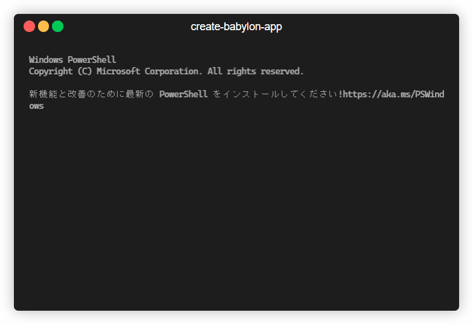

<h1 align="center">
  <p align="center">create-babylon-app<p/>
</h1>

<h3 align="center">

[](https://github.com/drumath2237/create-babylon-app/actions/workflows/ci.yml)
[](https://github.com/drumath2237/create-babylon-app/actions/workflows/release.yml)


</h3>

<div align="center">


<div/>
  
<div align="left">

## About

A CLI for scaffolding Babylon.js Web App 🛠  
create-babylon-app provides some [Vite](https://vitejs.dev/) based Node.js project.
For example, template of `simple-ts` has file structure like below.

```txt
/
├─ dist/
├─ src/
│    ├─ main.ts
│    └─ style.css
├─ index.html
├─ package.json
└─ tsconfig.json
```

## Recommended Environment

- Node.js 18/20
- npm 10.x
- pnpm 9.x
- Babylon.js 7

npm and pnpm are recommended!

## Usage

You can use create-babylon-app by typing following command in the terminal.

```
npm create babylon-app
```

Some command line args are supported.

| args         | alias | description                                 | type    |
| :----------- | :---- | :------------------------------------------ | :------ |
| `--name`     | `-n`  | project name you want to create             | string  |
| `--template` | `-t`  | template name (see template section)        | string  |
| `--install`  | `-i`  | install dependencies after copying template | boolean |

You can use them like below.

```
npm create babylon-app --name babylon-app --template simple-ts -i
```

## Templates

This app provides following templates.

| template name(for -t option) | language   | description                                |
| :--------------------------- | :--------- | :----------------------------------------- |
| `simple-js`                  | JavaScript | Most simple JavaScript template            |
| `simple-ts`                  | TypeScript | Most simple TypeScript template            |
| `playground-js`              | JavaScript | Playground based project                   |
| `playground-ts`              | TypeScript | Playground based project                   |
| `library`                    | TypeScript | Template for developing Babylon.js library |

## For Development

```sh
pnpm i

# run command without build
pnpm dev

# build
pnpm build

# run built app
pnpm start
```

### Release Flow

- (in local) create `release/vx.x.x` branch and push
- (in local) `pnpm version:set`
- (Pull Req) Create PR and merge it
  - then, automatically published to npm
 
## Author

[@drumath2237](https://twitter.com/ninisan_drumath)

<div/>
